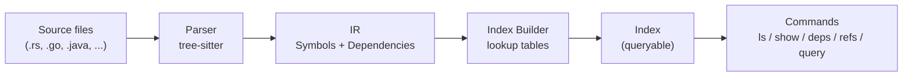

# Overview

## The problem

Agents that navigate code typically do one of two things:

- **Read whole files** — accurate but expensive; a 500-line file costs 500 lines of context even if you only needed the function signatures.
- **Grep for patterns** — cheap but fragile; regex can't tell a function definition from a comment, and it can't answer "what does this function call?".

smartgrep's answer: parse the source structure once, store it as a queryable index, and let agents ask structural questions instead of textual ones.

```
# Bad: read everything to find one thing
cat src/parser/rust.rs

# Bad: grep can't distinguish definitions from references
grep -r "fn parse" src/

# Good: ask the structure directly
smartgrep ls functions --in src/parser/
smartgrep deps parse_file
smartgrep query "structs where file contains 'ir/' | with fields"
```

## The three-layer pipeline



Each layer has a single contract with its neighbors:

| Layer | Input | Output |
|-------|-------|--------|
| Parser | Source file | `Ir` (symbols + deps) |
| Index Builder | `Ir` | `Index` (lookup tables) |
| Commands | `Index` | Text or JSON output |

The contracts are defined as Rust types. Parsers produce `Ir`. The builder consumes `Ir` and produces `Index`. Commands consume `Index`. None of the layers knows about the others' internals.

## Why this structure matters

Adding a language means writing one parser. The builder and every command work unchanged because they only see `Ir` and `Index`. This is the core architectural promise.

---

Next: [02 — IR](02-ir)
